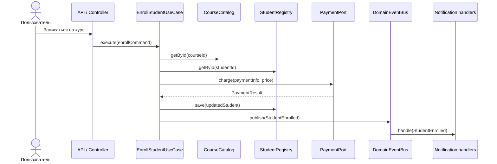
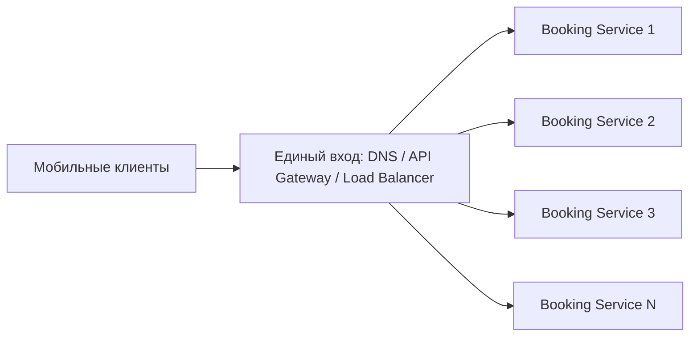
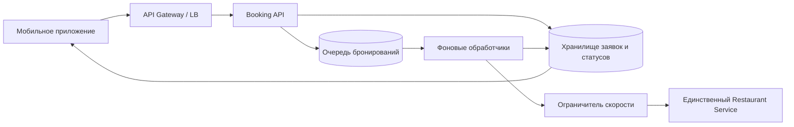
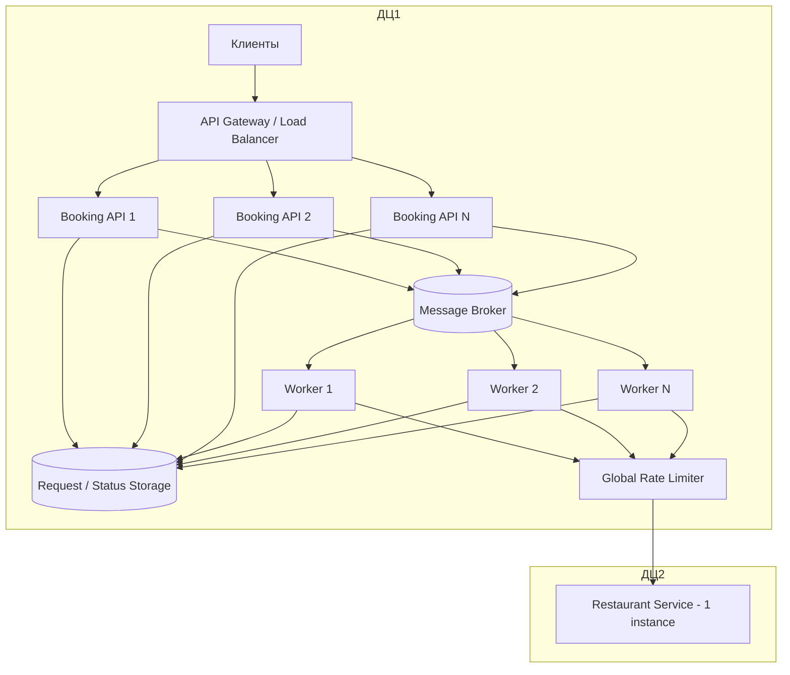
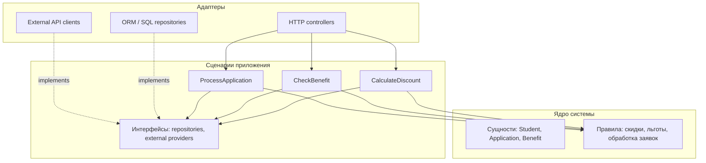
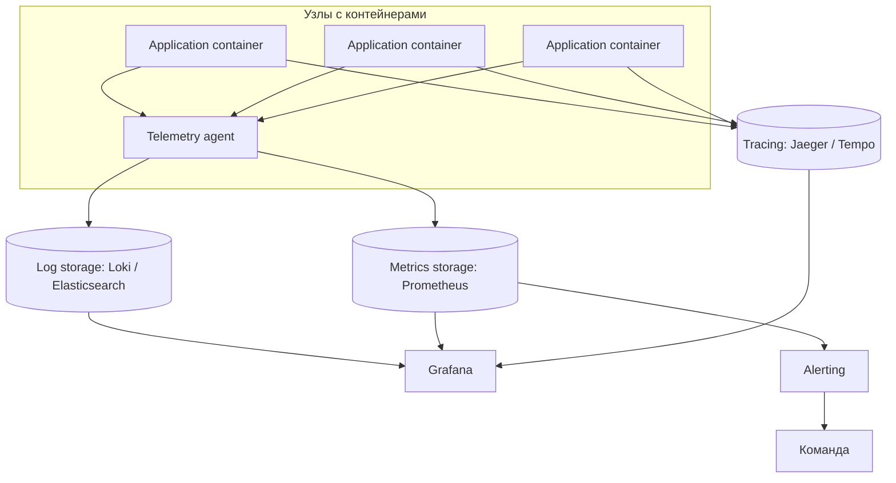

# Решение домашней работы по архитектуре программных систем

Документ содержит концептуальные решения по четырём заданиям. Код не приводится, так как по условиям работы достаточно архитектурного описания, диаграмм и обоснования выбранных решений.

## Навигация

- [Задание 1. Перепроектирование системы онлайн-курсов](#задание-1-перепроектирование-системы-онлайн-курсов)
- [Задание 2. Бронирование ресторанов при резких всплесках нагрузки](#задание-2-бронирование-ресторанов-при-резких-всплесках-нагрузки)
- [Задание 3. Отделение бизнес-правил от технических деталей](#задание-3-отделение-бизнес-правил-от-технических-деталей)
- [Задание 4. Наблюдаемость контейнерного приложения](#задание-4-наблюдаемость-контейнерного-приложения)

---

# Задание 1. Перепроектирование системы онлайн-курсов

## 1. Анализ исходной реализации

В исходном варианте почти вся логика находится в одном классе `CourseManager`. Такой класс одновременно является фабрикой курсов, хранилищем данных, сервисом оценивания, отправителем уведомлений и клиентом внешней платёжной системы. Из-за этого он становится слишком важной точкой системы: любое новое требование приводит к изменению одного и того же класса.

Основные проблемы исходной архитектуры:

| Проблема | Как проявляется в текущей системе | Почему это плохо |
|---|---|---|
| Слишком много обязанностей в одном классе | `CourseManager` создаёт курсы, хранит данные, считает оценки, отправляет письма и вызывает платёжный API | Класс трудно читать, тестировать и изменять |
| Создание курсов через условия | Используются проверки вида `if type == "online"`, `else if type == "offline"` | При появлении нового типа курса приходится менять существующий код |
| Единый алгоритм расчёта оценки | Все курсы оцениваются одним зашитым способом | Нельзя гибко задавать разные правила оценивания |
| Уведомления находятся внутри бизнес-методов | В коде сценариев вызывается `sendEmail(...)` | Для добавления SMS, push или Telegram придётся менять бизнес-логику |
| Прямая зависимость от платёжного API | Внутри бизнес-логики используются классы стороннего сервиса оплаты | Замена платёжного провайдера затронет основной код системы |
| Повторение похожих действий | В разных методах повторяются проверки, сохранение, уведомления и обработка результата | Нарушается DRY, растёт риск расхождения логики |

Следовательно, главная цель нового решения — убрать из системы «центральный перегруженный класс» и заменить его набором небольших компонентов с понятными границами ответственности.

## 2. Предлагаемая архитектурная идея

В новой структуре `CourseManager` заменяется прикладным сервисом `LearningApplicationService`. Этот сервис не занимается техническими деталями самостоятельно. Он только управляет порядком выполнения сценария: получить данные, создать нужный объект, вызвать оплату, сохранить результат и опубликовать событие.

Остальная логика выносится в отдельные роли:

- создание курсов — в фабрики;
- расчёт оценок — в стратегии;
- уведомления — в обработчики событий;
- интеграция с оплатой — в адаптер;
- доступ к данным — в репозитории;
- повторяющиеся операции — в отдельные команды или use case-классы.

Такой вариант сохраняет простоту: вместо сложного универсального менеджера появляются маленькие классы, каждый из которых отвечает за одну вещь.

## 3. Диаграмма классов

```mermaid
classDiagram
    direction TB

    class LearningApplicationService {
        +openCourse(courseType, courseData)
        +enroll(studentId, courseId, paymentInfo)
        +finishLearning(studentId, courseId, progress)
    }

    class CourseCatalog {
        +add(course)
        +getById(courseId)
    }

    class StudentRegistry {
        +getById(studentId)
        +save(student)
    }

    class CourseCreator {
        <<interface>>
        +create(courseData) Course
    }

    class OnlineCourseCreator
    class OfflineCourseCreator
    class IntensiveCourseCreator

    CourseCreator <|.. OnlineCourseCreator
    CourseCreator <|.. OfflineCourseCreator
    CourseCreator <|.. IntensiveCourseCreator

    class CourseCreatorResolver {
        +resolve(courseType) CourseCreator
    }

    CourseCreatorResolver o-- CourseCreator
    LearningApplicationService --> CourseCreatorResolver
    LearningApplicationService --> CourseCatalog
    LearningApplicationService --> StudentRegistry

    class Course {
        <<abstract>>
        -AssessmentPolicy assessmentPolicy
        +calculateResult(progress)
    }

    class OnlineCourse
    class OfflineCourse
    class IntensiveCourse

    Course <|-- OnlineCourse
    Course <|-- OfflineCourse
    Course <|-- IntensiveCourse

    class AssessmentPolicy {
        <<interface>>
        +assess(progress) FinalGrade
    }

    class HomeworkAndExamPolicy
    class ExamOnlyPolicy
    class CreditNoCreditPolicy

    AssessmentPolicy <|.. HomeworkAndExamPolicy
    AssessmentPolicy <|.. ExamOnlyPolicy
    AssessmentPolicy <|.. CreditNoCreditPolicy
    Course o-- AssessmentPolicy

    class PaymentPort {
        <<interface>>
        +charge(paymentInfo, amount) PaymentResult
    }

    class PaymentProviderAdapter
    class ExternalPaymentSdk {
        <<external>>
        +createTransaction(...)
    }

    PaymentPort <|.. PaymentProviderAdapter
    PaymentProviderAdapter --> ExternalPaymentSdk
    LearningApplicationService --> PaymentPort

    class DomainEventBus {
        +publish(event)
        +subscribe(handler)
    }

    class EventHandler {
        <<interface>>
        +handle(event)
    }

    class EmailHandler
    class PushHandler
    class SmsHandler

    EventHandler <|.. EmailHandler
    EventHandler <|.. PushHandler
    EventHandler <|.. SmsHandler
    DomainEventBus o-- EventHandler
    LearningApplicationService --> DomainEventBus

    class EnrollStudentUseCase {
        +execute(command)
    }

    class FinishCourseUseCase {
        +execute(command)
    }

    LearningApplicationService --> EnrollStudentUseCase
    LearningApplicationService --> FinishCourseUseCase
```

## 4. Ответственности основных компонентов

### `LearningApplicationService`

Координирует пользовательские сценарии. Например, при записи студента на курс он получает курс и студента из репозиториев, инициирует оплату через `PaymentPort`, фиксирует запись и публикует событие о зачислении. Он не знает, как устроен внешний платёжный SDK и через какой канал уйдёт уведомление.

### `Course`, `OnlineCourse`, `OfflineCourse`, `IntensiveCourse`

Описывают предметную область. Общие свойства и поведение находятся в базовом `Course`, а особенности конкретного формата обучения — в наследниках. При этом правила оценивания не зашиваются в наследники напрямую, а подключаются через `AssessmentPolicy`.

### `AssessmentPolicy`

Интерфейс для расчёта итогового результата. Он позволяет иметь разные правила для разных курсов:

- `HomeworkAndExamPolicy` — учитывает домашние задания, тесты и экзамен;
- `ExamOnlyPolicy` — берёт результат только итогового экзамена;
- `CreditNoCreditPolicy` — возвращает зачёт или незачёт.

### `CourseCreator` и конкретные создатели курсов

Каждый класс-создатель отвечает за один тип курса. Например, `OnlineCourseCreator` создаёт онлайн-курс и может сразу назначить ему подходящую стратегию оценивания. Основной сервис при этом не содержит цепочку `if/else`.

### `CourseCreatorResolver`

Хранит соответствие между типом курса и объектом-создателем. Если появляется новый формат курса, например `IntensiveCourse`, нужно зарегистрировать новый creator, а не переписывать бизнес-сценарии.

### `PaymentPort` и `PaymentProviderAdapter`

`PaymentPort` — внутренний контракт системы для оплаты. `PaymentProviderAdapter` реализует этот контракт через конкретный внешний SDK. Если компания сменит платёжный сервис, изменится адаптер, а прикладная логика останется прежней.

### `DomainEventBus` и обработчики событий

После важных действий система публикует события: `CourseOpened`, `StudentEnrolled`, `PaymentSucceeded`, `CourseFinished`. Уведомители подписываются на эти события. Благодаря этому запись на курс не содержит прямого вызова `sendEmail(...)`.

### `CourseCatalog` и `StudentRegistry`

Это абстракции доступа к данным. Они скрывают, где именно хранятся курсы и студенты: в памяти, SQL-базе, NoSQL-хранилище или внешней системе.

### `EnrollStudentUseCase`, `FinishCourseUseCase`

Инкапсулируют повторяемые сценарии. Это снижает дублирование: если запись на курс используется из API, админки или фоновой задачи, порядок действий остаётся единым.

## 5. Использованные паттерны проектирования

| Паттерн | Где применён | Что даёт системе |
|---|---|---|
| **Factory Method** | `CourseCreator` и реализации `OnlineCourseCreator`, `OfflineCourseCreator`, `IntensiveCourseCreator` | Создание конкретного курса вынесено из прикладного сервиса. Новый тип курса добавляется через новый creator. |
| **Strategy** | `AssessmentPolicy` и её реализации | Алгоритмы оценивания становятся взаимозаменяемыми. Для курса можно выбрать подходящую политику без изменения класса сервиса. |
| **Observer** | `DomainEventBus` и обработчики `EmailHandler`, `PushHandler`, `SmsHandler` | Уведомления реагируют на события, а не вызываются напрямую из бизнес-логики. |
| **Adapter** | `PaymentProviderAdapter`, реализующий `PaymentPort` поверх внешнего SDK | Внешний платёжный API изолирован от доменной и прикладной логики. |
| **Command** | Команды для use case-ов записи и завершения курса | Сценарии оформлены как самостоятельные операции, которые можно переиспользовать, логировать и при необходимости ставить в очередь. |
| **Repository** | `CourseCatalog`, `StudentRegistry` | Доступ к данным отделён от бизнес-логики. Это не GoF-паттерн, но важный архитектурный шаблон для снижения связанности. |

## 6. Соответствие проблем и решений

| Проблема | Решение | Используемый паттерн | Обоснование |
|---|---|---|---|
| Один класс выполняет почти всё | Разделить систему на прикладный сервис, доменные объекты, фабрики, стратегии, репозитории, адаптеры и обработчики событий | Разделение ответственности | У каждого компонента появляется своя причина для изменения |
| Курсы создаются через `if/else` | Ввести `CourseCreator` для каждого типа курса и выбирать его через resolver | Factory Method | Новый тип курса добавляется расширением, а не изменением существующей логики |
| Оценивание зашито в одном методе | Передать расчёт результата объекту `AssessmentPolicy` | Strategy | Правила оценивания можно менять независимо от курса и сервиса |
| Уведомления встроены в бизнес-код | Публиковать события и обрабатывать их отдельными подписчиками | Observer | Добавление нового канала уведомлений не требует изменения сценария записи или завершения курса |
| Платёжный API вызывается напрямую | Работать только с интерфейсом `PaymentPort`, а внешний SDK спрятать в адаптер | Adapter | При смене провайдера оплаты меняется только инфраструктурный адаптер |
| Похожая логика повторяется | Вынести сценарии в use case/command-объекты | Command, DRY | Один сценарий описывается один раз и переиспользуется из разных входных точек |
| Хранение данных смешано с логикой | Использовать репозитории/каталоги как абстракции доступа к данным | Repository | Основные сценарии не зависят от конкретной БД или ORM |

## 7. Пример сценария записи студента

## 8. Вывод по заданию 1

Новая структура устраняет главную проблему исходной системы — чрезмерную концентрацию логики в `CourseManager`. Объекты создаются фабриками, оценки считаются стратегиями, уведомления отправляются через события, внешний платёжный сервис скрыт за адаптером, а работа с данными вынесена в репозитории. Архитектура становится расширяемой и лучше соответствует принципам DRY, KISS, SRP, OCP и DIP.

---

# Задание 2. Бронирование ресторанов при резких всплесках нагрузки

## 1. Что происходит в исходной системе

Есть два сервиса:

- сервис бронирований в ДЦ1;
- сервис ресторанов в ДЦ2.

Сервис бронирований можно масштабировать, а сервис ресторанов существует только в одном экземпляре, и его нельзя копировать или менять. При обычной нагрузке система получает около 100 запросов в секунду. После публикации знаменитости поток резко поднимается до 50 000 запросов в секунду и держится 10–15 минут.

При этом бизнес-условия важны:

- свободных столиков достаточно для всех;
- отказывать пользователям в пиковый момент нельзя;
- обработка может быть не мгновенной, главное — завершить её в течение 24 часов.

## 2. Центральная проблема №1: нагрузка неправильно распределяется между экземплярами сервиса бронирований

### Суть проблемы

Мобильное приложение само выбирает IP сервиса бронирований. У всех пользователей список IP одинаковый и отсортирован одинаково. Приложение идёт на первый адрес, если он не отвечает — на второй, затем на третий.

При пике это превращается не в балансировку, а в последовательное уничтожение экземпляров:

1. весь поток идёт в первый экземпляр;
2. первый падает;
3. весь поток переходит во второй;
4. второй падает;
5. процесс повторяется.

Даже большое количество экземпляров не решит проблему, если клиенты продолжают выбирать адрес таким образом.

### Решение

Нужно сделать единую входную точку и перенести распределение запросов с клиента на инфраструктуру.

Что предлагается:

- использовать DNS-имя или API Gateway вместо списка IP в приложении;
- поставить перед сервисом бронирований балансировщик нагрузки;
- распределять запросы по алгоритму round-robin, least connections или аналогичному;
- включить health checks, чтобы не отправлять трафик на неработающие экземпляры;
- масштабировать сервис бронирований в ДЦ1 горизонтально;
- для старых версий приложения по возможности перенаправить уже зашитые IP на прокси/балансировщики.

Так сервис бронирований перестаёт падать каскадом, а добавление новых экземпляров действительно увеличивает пропускную способность.

## 3. Центральная проблема №2: пиковый поток напрямую пробивает единственный сервис ресторанов

### Суть проблемы

Сейчас каждый пользовательский запрос приводит к синхронному REST-вызову сервиса ресторанов. Это создаёт две опасности:

- пользовательский запрос зависит от задержек и ошибок удалённого сервиса в другом ДЦ;
- при 50 000 rps весь пик сразу попадёт в единственный сервис ресторанов.

Так как сервис ресторанов нельзя масштабировать, он неизбежно станет бутылочным горлышком. Проблему нельзя решить только увеличением числа сервисов бронирований: они просто быстрее перегрузят сервис ресторанов.

### Решение

Нужно перестать обрабатывать бронирование синхронно и перейти к модели «приняли заявку сейчас, оформили бронь позже».

Новый поток обработки:

1. Клиент отправляет запрос на бронирование.
2. `Booking API` сохраняет заявку со статусом `PENDING`.
3. Заявка попадает в очередь.
4. Клиент сразу получает ответ, что заявка принята.
5. Фоновые обработчики постепенно читают очередь.
6. Перед вызовом сервиса ресторанов применяется общий rate limit.
7. После успешной обработки статус меняется на `CONFIRMED`.
8. Пользователь видит статус в приложении или получает уведомление.

## 4. Почему очередь здесь является ключевым элементом

По условию известно, что если распределить нагрузку на сервис ресторанов равномерно в течение дня, он справится и будет использовать только около 20% мощности. Значит, системе не нужно немедленно пропускать весь пик через сервис ресторанов. Нужно накопить всплеск и обработать его плавно.

Очередь выполняет роль буфера между резким пользовательским трафиком и медленным внешним ограничением.

Дополнительные элементы, которые нужны для надёжности:

| Элемент | Назначение |
|---|---|
| Идемпотентный ключ заявки | Если приложение повторит запрос, не будет создано несколько одинаковых броней |
| Статусы `PENDING`, `PROCESSING`, `CONFIRMED`, `RETRYING` | Пользователь и поддержка видят текущее состояние заявки |
| Retry с экспоненциальной паузой | Временные сбои сервиса ресторанов не приводят к потере заявки |
| Dead Letter Queue | Проблемные заявки изолируются для ручного анализа |
| Rate limiter | Единственный сервис ресторанов получает только безопасный объём запросов |
| Мониторинг размера очереди | Можно проверить, успевает ли система уложиться в SLA 24 часа |

## 5. Итоговая целевая схема

## 6. Таблица решений

| Центральная проблема | Архитектурное изменение | Почему это устраняет проблему |
|---|---|---|
| Клиенты создают перекос нагрузки, потому что у всех одинаковый порядок IP | Ввести API Gateway / Load Balancer и единое DNS-имя | Запросы распределяются инфраструктурой, а не мобильным приложением. Экземпляры сервиса бронирований используются равномерно |
| Синхронная связь с единственным сервисом ресторанов передаёт ему весь пик | Ввести очередь, фоновые обработчики и rate limit на вызовы сервиса ресторанов | Пользователям не отказывают, пик сохраняется как backlog, а сервис ресторанов получает ровный управляемый поток |

## 7. Вывод по заданию 2

В системе ломаются две границы: входной трафик неправильно распределяется между экземплярами сервиса бронирований, а затем весь всплеск напрямую передаётся в единственный сервис ресторанов. Первая проблема решается нормальной серверной балансировкой. Вторая — асинхронной обработкой через очередь и ограничением скорости обращений к сервису ресторанов. Такое решение выполняет бизнес-требование: заявки принимаются даже во время пика и обрабатываются в течение допустимых 24 часов.

---

# Задание 3. Отделение бизнес-правил от технических деталей

## 1. Что в текущей структуре неудачно

В учебной информационной системе правила скидок, льгот и обработки заявок размещены в контроллерах и сервисах, которые одновременно зависят от HTTP, ORM, SQL и внешних API. Это означает, что бизнес-логика смешана с инфраструктурой.

Главная архитектурная ошибка — бизнес-правила находятся не в центре системы, а внутри технических слоёв. Из-за этого изменения базы данных, ORM или внешнего API вынуждают команду трогать код, который отвечает за предметную область.

Проблемы такого решения:

- контроллеры становятся слишком умными;
- правила расчёта сложно тестировать без базы данных и HTTP-слоя;
- бизнес-логика меняется вместе с техническими деталями;
- система хуже переносит смену БД, ORM или внешнего сервиса;
- разработчикам сложнее понять, где находятся настоящие правила предметной области.

## 2. Подход, который здесь уместен

Здесь подходит **Clean Architecture**. Также можно описать решение через близкий подход **Hexagonal Architecture**, или **Ports and Adapters**.

Идея подхода: бизнес-правила должны быть независимым ядром. HTTP, база данных, ORM и внешние API должны находиться снаружи и подключаться через интерфейсы.

## 3. За счёт чего это решает проблему

### Бизнес-логика перестаёт зависеть от фреймворков

Правила скидок и льгот становятся обычными доменными объектами или доменными сервисами. Они не знают, используется ли REST, GraphQL, PostgreSQL, ORM или внешний API.

### Зависимости разворачиваются в правильную сторону

Use case объявляет, что ему нужно, например `StudentRepository` или `BenefitCheckProvider`. Инфраструктурный слой реализует эти интерфейсы. Поэтому бизнес-логика зависит от абстракций, а не от технических классов.

### Технические изменения становятся локальными

Если изменилась схема таблиц, меняется SQL/ORM-репозиторий. Если изменился внешний API, меняется адаптер внешнего сервиса. Правило расчёта скидки при этом не переписывается.

### Тестирование упрощается

Правило скидки можно проверить обычным unit-тестом без поднятия сервера и базы данных. Для зависимостей достаточно подставить mock или in-memory реализацию.

## 4. Вывод по заданию 3

Архитектурно неудачно то, что бизнес-правила привязаны к HTTP, ORM, SQL и внешним API. Уместный подход — Clean Architecture / Ports and Adapters. Он решает проблему за счёт разделения ядра системы и инфраструктуры: бизнес-логика становится независимой, а технические механизмы подключаются как заменяемые адаптеры.

---

# Задание 4. Наблюдаемость контейнерного приложения

## 1. Анализ проблемы

Приложение работает в контейнерах на нескольких узлах. Контейнеры иногда перезапускаются, время ответа растёт, а команда узнаёт о сбоях в основном от пользователей. Логи лежат внутри контейнеров, поэтому после перезапуска их трудно получить или они теряются.

Это означает, что в системе недостаточно наблюдаемости. Команда не видит полную картину состояния приложения и не может быстро связать симптомы: рост задержек, ошибки, рестарты контейнеров и состояние узлов.

## 2. Что нужно добавить

Наблюдаемость стоит строить вокруг трёх типов данных:

- **метрики** — числовые показатели работы системы;
- **логи** — подробные события и ошибки;
- **трассировки** — путь конкретного запроса через компоненты.

К ним нужны алерты, дашборды и практики разбора инцидентов.

## 3. Инструменты и практики

| Что добавить | Пример инструментов | Какую проблему решает |
|---|---|---|
| Централизованный сбор логов | Fluent Bit, Promtail, Filebeat + Loki или Elasticsearch | Логи сохраняются вне контейнера и не исчезают при его перезапуске |
| Структурированный формат логов | JSON-логи с `level`, `service`, `request_id`, `trace_id`, `error` | По логам можно быстро искать, фильтровать и связывать события |
| Сбор метрик приложения | Prometheus, OpenTelemetry Metrics | Команда видит latency, RPS, error rate и другие признаки деградации |
| Метрики контейнеров и узлов | cAdvisor, node exporter, kube-state-metrics | Можно понять, почему контейнеры перезапускаются: память, CPU, OOM, проблемы узла |
| Дашборды | Grafana | Даёт единую точку просмотра состояния системы |
| Алертинг | Alertmanager или Grafana Alerting | Команда узнаёт о проблеме раньше пользователей |
| Распределённая трассировка | OpenTelemetry + Jaeger или Tempo | Помогает найти конкретный участок запроса, где возникла задержка |
| Correlation ID / Trace ID | Проброс идентификатора через все сервисы | Метрики, логи и трейсы можно связать с одним пользовательским запросом |
| Health checks | Liveness, readiness, startup probes | Оркестратор корректно понимает, когда контейнер жив и когда готов принимать трафик |
| SLI/SLO | Например, p95 latency, error rate, availability | Команда оценивает систему по пользовательскому качеству, а не только по CPU и памяти |
| Runbooks и postmortem | Инструкции на случай аварий и разбор причин после инцидента | Инциденты разбираются быстрее, а повторяющиеся проблемы устраняются системно |

## 4. Целевая схема наблюдаемости

## 5. Примеры полезных сигналов

| Сигнал | Что показывает |
|---|---|
| Рост `p95` или `p99` latency | Пользователи начинают ждать ответ дольше обычного |
| Рост error rate | Увеличивается доля неуспешных запросов |
| Частые рестарты контейнеров | Возможна нехватка ресурсов, падения процесса или ошибка конфигурации |
| OOMKilled | Контейнер завершён из-за нехватки памяти |
| CPU throttling | Контейнер ограничивается по CPU, что может увеличивать время ответа |
| Увеличение количества 5xx | Ошибки на стороне сервиса или его зависимостей |
| Отсутствие логов от сервиса | Сервис мог зависнуть или перестать корректно работать |

## 6. Как это помогает при инциденте

Если время ответа выросло, новая система наблюдаемости позволяет действовать по шагам:

1. Алерт сообщает, что задержка или процент ошибок вышли за норму.
2. Дашборд показывает, какой сервис или узел ведёт себя нестабильно.
3. Метрики контейнеров показывают, есть ли рестарты, нехватка памяти или CPU throttling.
4. Трассировка показывает, в каком участке запроса появилась задержка.
5. Логи по `trace_id` позволяют найти конкретную ошибку.
6. Runbook помогает дежурному быстро выполнить стандартные действия.

## 7. Вывод по заданию 4

В текущей системе не хватает централизованных логов, метрик, алертов и трассировки. Из-за этого команда узнаёт о проблемах поздно и теряет часть данных после перезапуска контейнеров. Добавление Prometheus/Grafana, централизованного логирования, OpenTelemetry, алертов, health checks и практик incident response создаёт единую картину работы системы и ускоряет расследование инцидентов.

---

# Общий вывод

Во всех заданиях ключевая идея одна: архитектура должна отделять изменяемые детали от устойчивой логики системы.

- В системе онлайн-курсов это достигается через декомпозицию `CourseManager` и применение Factory Method, Strategy, Observer, Adapter, Command и Repository.
- В системе бронирования — через нормальную балансировку входа и асинхронную обработку заявок через очередь.
- В учебной информационной системе — через Clean Architecture / Ports and Adapters.
- В контейнерном приложении — через полноценную наблюдаемость: метрики, логи, трассировки, алерты и дашборды.

Такие решения делают системы менее связанными, более расширяемыми и удобными для сопровождения.
